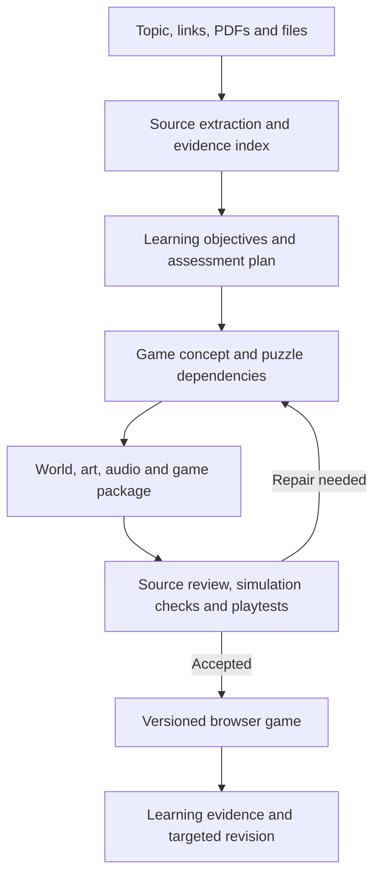

# Astraified: research and proposed build plan

Astraified turns source material into a small, complete game in which understanding the subject helps the player succeed. Its product promise is a memorable experience with traceable explanations and opportunities to demonstrate learning.

The recommended first release is a browser demo for high school and college learners, with a polished point-and-click adventure and a compact 3D puzzle experience. Both use a common learning model and game runtime. Build one excellent reference mission, then prove that the generator can produce meaningfully different missions from new sources.

This is a proposal for review, not an implementation. Research was checked on September 10, 2026. Audience and demo priority are confirmed; browser delivery, the first subject, scope, and effort estimates are recommendations. Astra is available to the project through Codex and API credits, per the project owner; account-specific API calls have not been tested.

## 1. Product decisions

| Decision | Recommendation | Reason |
| --- | --- | --- |
| First audience | High school and college learners; choose prior knowledge per lesson | A single age label cannot determine conceptual difficulty. |
| First milestone | An impressive, playable demo with visible source-to-game generation | Establish the experience quality and the generator's contribution. |
| Delivery | Browser, initially desktop/laptop | Share a link and play; support both cinematic fixed-camera scenes and walkable 3D. |
| Initial genres | Point-and-click investigation; compact 3D exploration/puzzle | Covers the requested range while sharing useful systems. |
| Lesson size | About 10–20 minutes and three observable objectives | Gives the game enough depth while keeping scope and evaluation manageable. |
| Creative scope | Original worlds, characters, dialogue, layouts, puzzles, and asset combinations | The generated game should have its own identity. |
| Runtime strategy | Reusable gameplay foundation plus generated game packages | Reliable controls, saves, accessibility, and simulation rules can survive creative variation. |
| First candidate subject | Basic series/parallel circuits | Players can manipulate the concept and immediately see a meaningful consequence. |

The long-term product can cover many subjects. The first demo should make a bounded claim about supported sources, concepts, and game formats. Large documents become a sequence of missions, with scope shown before production.

## 2. What research changes about the design

Learning should be integrated into the game's central action. Habgood and Ainsworth's mathematics-game studies found better learning and voluntary engagement when the mathematics was embedded in gameplay. The samples were small and domain-specific; the finding motivates a design principle rather than guaranteeing an outcome for Astraified. [Original study](https://tecfa.unige.ch/tecfa/teaching/BSEP/articles/Habgood_Ainsworth_2011.pdf).

For every objective, the generator must create a chain:

**Source evidence → learning objective → meaningful player action → interpretable consequence → feedback → a new application.**

For example, “recognize parallel circuits” becomes “rewire two beacon lamps so one keeps working when the other's branch opens.” The game then checks whether the learner can reason about a differently arranged circuit.

| Learning principle | Astraified behavior |
| --- | --- |
| Retrieval and explanation | Ask for a prediction before an experiment and a short explanation afterward. Reveal evidence gradually. |
| Worked examples and fading support | Demonstrate the first interaction, partially guide the next, then let the learner solve a related problem independently. |
| Useful feedback | Show what changed and why an attempted solution failed; provide a graduated hint ladder. |
| Concrete-to-abstract connection | Pair the physical-looking apparatus with a schematic, equation, or evidence map. |
| Transfer | End with a fresh situation whose surface details differ from the mission. |
| Spacing | Offer a later short mission that revisits the idea. A single session cannot demonstrate retention across days. |

These choices draw on the [IES learning practice guide](https://ies.ed.gov/ncee/wwc/PracticeGuide/1), [Karpicke and Blunt's retrieval experiment](https://pubmed.ncbi.nlm.nih.gov/21252317/), [Atkinson and colleagues' scaffolding experiments](https://experts.azregents.edu/en/publications/transitioning-from-studying-examples-to-solving-problems-effects-/), and [Shute's feedback review](https://myweb.fsu.edu/vshute/pdf/shute%202008_b.pdf). They require testing in the actual game.

Visual ambition remains a goal. Research on headset immersion has produced both worse learning in one science simulation and better retention in an instructional field trip. Those studies do not compare Astraified's proposed 2D and 3D modes; their practical lesson is to evaluate the implemented experience. Keep conceptual difficulty separate from navigation or reflex difficulty. [2019 experiment](https://www.sciencedirect.com/science/article/pii/S0959475217303274), [2022 experiment](https://link.springer.com/article/10.1007/s10648-022-09675-4).

## 3. Product and game precedents

| Precedent | What to learn from it |
| --- | --- |
| Club Penguin missions, supplied as inspiration | Compact adventures, personable characters, inventory, environmental clues, and satisfying mission payoffs. |
| [NotebookLM](https://blog.google/innovation-and-ai/models-and-research/google-labs/notebooklm-student-features/) | Source-grounded study aids and cited explanations establish a useful baseline. |
| [Rosebud](https://rosebud.ai/3d-game-maker) | Its vendor documentation describes editable browser game generation. Generation alone is already an adjacent capability. |
| [GDevelop's AI agent](https://gdevelop.io/blog/make-games-with-ai-agent-gdevelop-automated-prompt) | Iterative scene and behavior editing is a practical production workflow; complex systems still require refinement. |
| [PhET](https://phet.colorado.edu/en/research) | Interpretable simulations, productive exploration, and learner interviews inform the design. |
| [The Evolution of Trust](https://ncase.me/trust/words.html) | The player experiments with the explanatory model itself. |
| [Outer Wilds development notes](https://www.mobiusdigitalgames.com/news/archives/04-2016) | Curiosity and discoveries can provide progression; knowledge-dependent games need careful playtesting. |

The opportunity is the combination of source fidelity, substantive game design, and evidence of learning. This research does not establish market-wide uniqueness or independently verify competitors' output quality.

## 4. The first experience

**The Night the Lighthouse Went Dark** is a proposed 15-minute adventure at a stormy harbor observatory. A repair robot has made an unfortunate wiring change before the festival beacon is due to light. The learner explores four scenes, uses a tester, gathers evidence, and restores the harbor's equipment.

Use an original cast, environmental humor, deliberate composition, ambient sound, responsive object interactions, and a final lighthouse reveal. The visual target is a finished miniature adventure. Dialogue stays short, and each repaired system changes the world.

| Mission beat | Player action | Learning purpose |
| --- | --- | --- |
| Arrival and workshop | Predict an outcome; follow one demonstrated repair | Establish controls and a baseline without treating guided success as mastery. |
| Broken relay | Trace a path and test a disconnected circuit | Understand the need for a complete conductive loop. |
| Dim beacon | Compare identical lamps in simple series and parallel arrangements | Connect circuit structure to observable behavior. |
| Final repair | Build independent branches and test an open-branch failure | Apply the concept to a design requirement. |
| Debrief | Solve a new schematic and explain the prediction | Check application beyond the original room and component positions. |

Ground the lesson in a bounded source such as [OpenStax's series/parallel circuits section](https://openstax.org/books/college-physics-2e/pages/21-1-resistors-in-series-and-parallel). Specify an ideal constant-voltage supply and resistive components. Compute electrical behavior using a reviewed model; label the simplifying assumptions. A college extension could add resistance and power calculations after the introductory mission.

The **3D edition** uses a small walkable courtyard and beacon tower. Players inspect cable routes, manipulate modules, and switch between apparatus and schematic views. Spatial tracing makes the 3D presentation useful. Its interaction design changes, while the scientific model and learning objectives remain consistent. Offer station navigation and reduced camera motion.

For breadth after the reference mission, the demo must also generate a shorter graph/pathfinding mission from a new source, using a second reviewed mechanic family. This tests whether the system can change its objectives, puzzle dependencies, and player actions across subjects. Historical evidence evaluation belongs in the subsequent alpha because interpretation needs different assessment rules.

## 5. Genre selection

Genre should express both the learner's preference and the concept's needs. Recommend a fit with a one-sentence reason and respect the selection wherever a sound design is possible. This is a gameplay preference, not a claim about fixed “learning styles.”

| Format | Particularly suitable concepts | Core verbs | Order |
| --- | --- | --- | --- |
| Point-and-click investigation | Diagnosis, historical inquiry, causal reasoning, procedures | Inspect, compare, test, combine, justify | First flagship |
| 3D puzzle/laboratory | Spatial relationships, geometry, physical systems | Manipulate, measure, predict, build | Second selectable mode |
| Construction/automation | Algorithms, circuits, logic, networks | Connect, program, debug, optimize | Expand the shared puzzle toolkit |
| Management/strategy | Ecology, resource allocation, queues, feedback loops | Allocate, experiment, observe delays | Later |
| Dialogue/role-play | Language, argumentation, source interpretation | Ask, listen, support, revise | Later, with bounded rubrics |
| Action/platformer | Trajectories, timing, transformations | Aim, redirect, predict | Use when the action itself teaches |

Some material will need a different objective or a shorter experience. Show that limitation before spending time on assets. A dense reference sheet, contradictory sources, and a coherent explanatory chapter should produce different planning behavior.

## 6. Creator and learner flow

1. **Add material:** topic, public webpage links, PDFs, or supported files. Show which sources were successfully read.
2. **Set the lesson:** choose level, prior knowledge, session length, and game format. Present a short editable summary of what the learner will be able to do.
3. **Preview the direction:** show a premise, visual direction, and example interaction. Allow “make it more mysterious,” “include this diagram,” or “reduce the math.”
4. **Generate:** show real milestones such as understanding sources, building puzzles, creating scenes, and testing the game. Display playable draft and polished build as distinct states.
5. **Play and revise:** inspect the game; revise an objective, room, puzzle, or art direction without regenerating everything.
6. **Share and learn:** play through a browser link, save progress, use optional hints, and inspect source-backed explanations in a notebook.

A learner should be able to finish a generated mission without a live model call. Optional tutoring can add explanations; ordinary movement, puzzle consequences, and completion run locally.

## 7. Generation architecture

### Source and learning layers

Retain source URLs, file hashes, page numbers or section anchors, text spans, and relevant figures. For webpage inputs, preserve the exact retrieved content and report inaccessible pages. For topic-only input, research a small source set and show it. For supplied-source mode, identify any supplementary material explicitly.

Start with URLs, text/Markdown, and PDFs. Add DOCX/PPTX through a tested extraction adapter. Docling supports document structure, tables, images, OCR, and provenance, making it a candidate for durable extraction. Verify formulas and diagrams against page images when they matter to the lesson. [Docling capabilities](https://docling-project.github.io/docling/), [document representation](https://docling-project.github.io/docling/concepts/docling_document/).

Direct OpenAI PDF inputs can include text and page images, which offers a simpler early prototype route. Non-PDF document inputs extract text without embedded images or charts, so illustrated slides/documents need explicit rendering or conversion. Direct file analysis does not replace our own citation index. [Official file-input guidance](https://developers.openai.com/api/docs/guides/file-inputs).

Create a learning record with objectives, prerequisites, misconceptions, source links, valid explanations, model assumptions, and assessment rubrics. Keep factual statements separate from fictional world-building. Contradictions or insufficient evidence should trigger a scoped correction, omission, or clear request for better material.

### Game and execution layers

Generate a versioned package describing scenes, entities, interactions, puzzle dependencies, dialogue, assets, hints, and learning checks. The runtime supplies actions such as inspect, connect, rotate, compare, predict, and run experiment. Variety comes from composing these actions into different problems and worlds.

Keep exact simulations and state changes deterministic. For interpretation tasks, evaluate evidence and reasoning against a rubric and preserve uncertainty; a single hidden answer is often inappropriate. Record hint use and retries separately from independent performance.

Novel mechanics remain an expansion path: Astra can produce a small module against a constrained game API, then compile and test it in an isolated worker. Start with a small library of dependable mechanics and expand it when sources demand something new. This avoids making the first release depend on arbitrary code generation for every basic interaction.

Use a Node/TypeScript service for orchestration, a persistent job queue, Python workers for documents and Blender, and storage for source records, game versions, and assets. These are proposed components, not a requirement for a large initial cloud deployment. A local worker can support the first demo; public self-service generation requires hosted workers.

Worker boundaries matter because sources and generated scripts are untrusted: constrain URL fetching, isolate execution and parsers, keep credentials out of generated games, and cap job time and resource use. The learner receives an accepted game build with only its required assets.

## 8. Making specific use of Astra

OpenAI's current documentation verifies Astra's reasoning, coding, vision input, structured output, and tool-use capabilities. Tool calling uses the Responses API. Astra's direct output is text; image creation is a separate tool/model and 3D production requires our tooling. [Astra model reference](https://developers.openai.com/api/docs/models/gpt-6-astra).

| Capability | Proposed use |
| --- | --- |
| Async tool calling | Start independent art, extraction, rendering, and test jobs while planning other parts. The application still runs and tracks those jobs. |
| Mid-turn steering | Let the creator change difficulty or art direction during production. Version jobs so older results cannot overwrite the revised plan. |
| Reasoning changes with cache preservation | Spend more reasoning on concept-to-mechanic design and difficult repairs; reduce it for routine revisions. |
| Vision and computer use | Inspect source diagrams, rendered scenes, and actual playability; combine this with deterministic assertions. |
| Structured outputs and parallel specialists | Produce reviewable lesson/game packages, with separate content, design, asset, and test work where useful. |

Async behavior and steering are documented features, but do not automatically provide job cancellation, storage, or a production workflow. Steering cannot undo actions or cancel already-started tools; our job manager must handle stale outputs and cancellation. [Async tools](https://developers.openai.com/api/docs/guides/async-tool-calling), [steering](https://developers.openai.com/api/docs/guides/steering), [Astra guide](https://developers.openai.com/api/docs/guides/latest-model).

Use Astra in Codex to develop and improve Astraified. Use the API for the product's repeatable source-to-game pipeline. Verify the project's model and image access with a minimal smoke test when implementation begins.

## 9. Engine and asset recommendation

Use **TypeScript + Babylon.js**, with React/HTML for the creator interface, notebook, dialogue, and accessible controls. Babylon provides 3D rendering, picking, animation, audio, sprites/layers, and glTF support. A fixed-camera point-and-click mode and a walkable mode can share gameplay infrastructure. WebGL compatibility should be the baseline; WebGPU can enhance supported devices. This proposed integration still requires our own gameplay systems. [Babylon specifications](https://www.babylonjs.com/specifications/).

Godot is a credible alternative if native distribution becomes the priority. Its current web export has WebGL 2 and language/hosting constraints worth testing before choosing it for browser delivery. Three.js offers flexibility with more gameplay infrastructure to assemble; Phaser becomes attractive for a dedicated 2D action genre. [Godot web export](https://docs.godotengine.org/en/stable/tutorials/export/exporting_for_web.html), [Three.js game guide](https://threejs.org/manual/en/game.html), [Phaser](https://docs.phaser.io/).

**Install Blender during the build phase.** Use its background Python workflow to construct room kits, position props, create materials and lighting, render adventure backgrounds, and export browser assets. Normalize models and create simple collision shapes before delivery. glTF/GLB carries supported assets; arbitrary Blender shaders, physics, and behavior need baking or runtime implementation. [Blender command-line reference](https://docs.blender.org/manual/en/4.0/advanced/command_line/arguments.html), [glTF export](https://docs.blender.org/manual/en/4.0/addons/import_export/scene_gltf2.html).

Use an explicit art guide across all production: palette, materials, proportions, camera framing, and reference characters. Combine procedural sets, a reusable asset library, and generated hero art. Current GPT Image tools support generation and iterative editing; check consistency through contact sheets and in-engine views. Generate important labels, formulas, and scientific geometry from verified data. [Official image-generation guide](https://developers.openai.com/api/docs/guides/image-generation).

Image-to-3D services such as [Meshy's documented API](https://docs.meshy.ai/en/api/image-to-3d) are optional experiments for selected props. Judge them by cleanup time and in-engine quality before adding a paid dependency. Asset rights and service access conditions belong in the asset manifest and provider evaluation.

Node, Python, FFmpeg, and a Godot application were found locally. Blender was not found on PATH or at `/Applications/Blender.app`; that is a limited check. No installation or product code was performed during this planning task.

## 10. Delivery sequence and acceptance gates

Estimates below are planning judgments for one developer working with Astra and part-time learner/content review. They are not measured build times. The gates determine readiness.

| Phase | Reviewable deliverable | Acceptance gate | Rough effort |
| --- | --- | --- | --- |
| 0. Prove the components | One source-linked interaction in both camera modes; one Blender asset in-browser; API smoke test | Rendering, source fidelity, basic controls, and API access verified | 1–2 working days |
| 1. Set the quality bar | Complete reference point-and-click mission with polished opening and ending | Three concept-driven puzzles; accurate simulation; fresh transfer task; first learner observations | 3–6 days |
| 2. Generate from sources | Upload-to-package pipeline with previews, retries, and source notebook; circuit and graph-routing mechanic families | Fresh-source benchmark below passes; actual cost and latency recorded | 4–8 days |
| 3. Add selectable 3D | Compact 3D mission using the same learning/game foundations | Useful spatial interaction, complete playthrough, readable UI, acceptable performance | 2–5 days |
| 4. Prepare the demo | Creator flow, saved build, reproducible generation run, target-browser checks | Clear account of what was generated, what was reused, and what passed review | 2–4 days |

Budget roughly **3–5 working weeks** for this scoped demo, with a review after the first few days to update estimates. A several-day teaser can show one polished room and a generated mini-puzzle; it would not establish a reliable general generator. Broader subject coverage and self-service reliability are subsequent milestones.

The minimum generation benchmark is explicit:

| Source case | Required output | Role |
| --- | --- | --- |
| Circuit reference source | Polished point-and-click mission and compact 3D edition | Establish the authored/reviewed quality bar. |
| A fresh bounded circuit source with changed examples and requirements | Generated point-and-click and 3D packages | Demonstrate source ingestion and meaningful variation in both modes. |
| A fresh introductory graph/pathfinding source | Generated short point-and-click routing mission | Demonstrate a second subject and mechanic family; 3D graph gameplay is optional. |
| Historical evidence or another interpretive subject | Deferred to alpha | Test a different kind of knowledge and assessment after the demo. |

For the fresh-source cases, freeze inputs and record generation before manual repair. The product may reuse engine code, asset kits, and reviewed simulation modules; report any human edits to the generated learning plan, puzzles, or content. Passing these cases establishes a bounded two-subject demo, not arbitrary-topic reliability.

The demo should expose two real selectable experiences. A curated reference is useful for setting quality, but the demo also needs a recorded or live end-to-end generation of fresh source material. Cached builds should be labeled when used.

Defer multiplayer, large open worlds, unrestricted mod/code execution, school administration, native packaging, and a large genre catalog until the central generation loop works. Each adds substantial systems work without proving the initial promise.

## 11. How to tell whether it works

Keep four outcomes separate: factual accuracy, playability, enjoyment, and learning.

| Dimension | Proposed first gate |
| --- | --- |
| Grounding | Every required educational claim/rule and assessed objective has source support; no unresolved critical content error. Human-review the demo lesson. |
| Playability | Full real-input playthrough; alternate action orders; saves/reloads; usable hints; no known blocking state. Verify rendered interactions, not only internal state transitions. |
| Generation reliability | Evaluate a fixed small source suite and fresh variants; report accepted builds, failures, repair attempts, cost, and elapsed time. Avoid claiming broad reliability from a handful of examples. |
| Visual quality | Coherent art, legible controls, satisfying feedback, and a memorable mission payoff in both modes. |
| Performance | Provisional target: 60 fps on the development laptop, usable 30 fps on an agreed lower-end device. Profile Chromium and Safari; set payload/load budgets from the first scene. |
| Learner experience | Observe 5–8 target learners, fix confusion, and assess perceived agency, enjoyment, and willingness to continue. This is a usability round. |
| Learning | Pretest, new-item posttest, independent transfer, and a later retention check. Report hint use and prior knowledge. |

For an efficacy claim, compare with a time-matched explanation plus practice and feedback; determine sample size and outcomes before the study. An early small pilot is useful for improving the product, not proving superiority. Gameplay-based assessment needs validation against independent measures. [Newton's Playground research](https://myweb.fsu.edu/vshute/pdf/JER.pdf).

Agent playtests can discover defects and check paths through a game. Human learners must establish whether the experience is enjoyable and improves understanding. One successful puzzle, particularly after hints or guessing, should not create a “mastered” label.

## 12. Cost and operating assumptions

As checked September 10, Astra Standard short-context pricing is **$10 per million uncached input tokens and $50 per million output tokens**, with separate cache rates and higher long-context rates. For illustration, 100,000 uncached input tokens plus 20,000 output tokens cost $2 at those rates. That is hypothetical text-model usage, not a per-game quote; actual jobs add reasoning/output use, repeated context, repairs, cache-write charges where applicable, images, rendering, and storage. [Official pricing](https://developers.openai.com/api/docs/pricing).

Track cost per accepted game, not just per generation attempt. Cap repair loops, reuse unchanged assets, cache source extraction and stable context, and separate fast preview from final art. Do not promise generation in seconds before measuring the full pipeline. API credits enable experimentation but do not establish a sustainable unit cost.

Choose a per-game ceiling after the first benchmark. Until then, report separate totals for model work, image generation, render/worker time, and failed attempts. Keep deployment local for the first production-tool spike, then choose hosting based on measured worker needs.

## 13. Decisions for review

The proposed starting point is **browser delivery, two selectable formats, one excellent circuit mission, and a generator designed to expand through new mechanics**. The most consequential remaining choices are:

1. Keep circuits as the first subject, or substitute a concept/source you care about more.
2. Choose the reference world's tone: cozy mystery is the proposal; science fiction, fantasy, or another original setting can use the same learning architecture.
3. Set any hard demo date and spending ceiling before committing to production scope.

Detailed evidence and alternatives are in [learning research](research-learning.md), [experience research](research-experience.md), and [engine research](research-engine.md).
