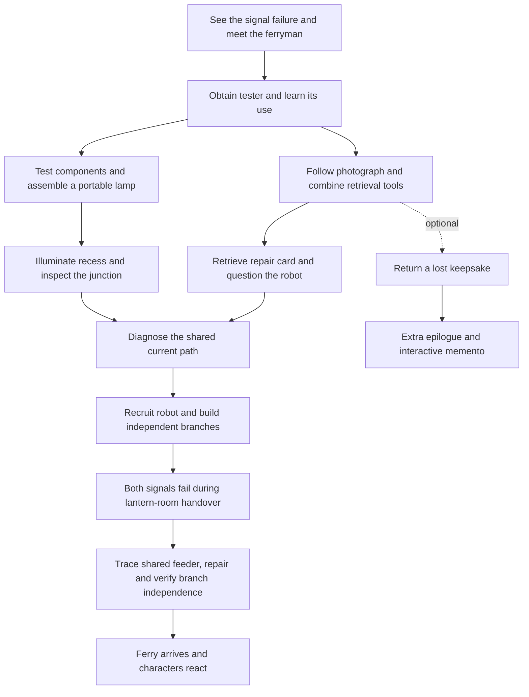

# Astraified Point-and-Click Direction

Build Astraified's next version as a complete illustrated adventure: explore rooms, talk to characters, gather and combine objects, follow several leads, and use the source concepts to change what happens. A mystery provides the reason to learn; the world supplies the evidence and the consequences.

The recommended foundation is **a 2D adventure runtime in Phaser, React for the surrounding application, and generated mission packages with explicit puzzle dependencies**. First establish the quality bar with one deliberately designed episode. Then make the generator produce another episode whose reasoning, object relationships, and story differ.

This direction supersedes the earlier recommendation to develop point-and-click and 3D together for the next milestone. The existing source ingestion, citations, deterministic simulations, and saved library remain useful. The current three-station progression and repeated experiment-to-quiz loop should be replaced.

## Evidence and scope

The research covers the eleven original browser PSA missions through contemporary walkthroughs, preserved transcripts, and mission records. Visual inspection included the illustrated Clockwork Repairs guide and selected decoded frames of a 2008 Operation Spy & Seek recording. Original-era fan guides are direct player accounts, not official design documentation. Community transcripts remain secondary evidence. Rewritten, Journey, and Nintendo DS additions were distinguished from the original browser versions.

The gameplay recording shows the scene occupying the main play area, a persistent inventory/code interface, map access, lateral navigation, character dialogue, and object close-ups. The illustrated guide shows a puzzle causing an amusing wrong outcome as well as the intended transformation. These observations support the proposed interaction and art direction; they do not establish Club Penguin's internal software architecture. [1](https://www.youtube.com/watch?v=hoZmxJPGV5Y) [2](https://agentbambi1.wordpress.com/mission7/)

Detailed evidence is in the companion research files. The original Flash missions were not played end to end during this study. Club Penguin is a precedent for adventure design, not evidence that Astraified will produce measurable learning.

## Why the current version feels more like an activity

The present implementation makes the next action explicit almost all the time: choose the available station, open its board, complete its experiment, answer its question. Characters mostly narrate a task. The island is an attractive selector for three learning activities.

The missing quality is the player's responsibility for forming a plan. An adventure lets someone notice a problem, consider an object or statement, decide where to investigate, try an idea, and discover a consequence. The player needs enough information to reason, but should not receive a complete procedure for every meaningful action.

| Current behavior | Proposed behavior |
| --- | --- |
| Three named stations unlock in a fixed order | Several rooms and two or three live leads; progress follows discovered facts and changed objects |
| A panel states the next task and procedure | Characters state a need; clues and tools help the player work out a solution |
| Most important actions happen in one generic modal | Inventory use, dialogue, and apparatus close-ups change the room itself |
| New sources change narrative text and board parameters | New sources change the central problem, evidence, object properties, and dependency structure |
| Every experiment ends with multiple-choice progression | Later situations require the same idea under a new constraint |
| Completion produces a summary and beacon effect | The ending resolves the mystery, changes the setting, and acknowledges optional discoveries |

This is a change to the game model, not just to the visual skin.

## What the missions actually offer

The useful precedent extends well beyond collecting keys. Different missions build their chains around observation, fabrication, rescue, diagnosis, cooperation, and indirect manipulation.

| Mission | Distinctive design element | Useful lesson for Astraified |
| --- | --- | --- |
| 1. Case of the Missing Puffles | A missing-pet investigation links coded information, tools, testimony, and a better viewpoint. Returning photographs earns a separate reward. | Introduce tools through a coherent investigation; separate the main goal from thoughtful extras. [3](https://clubpenguin.fandom.com/wiki/PSA_Mission_1:_Case_Of_The_Missing_Puffles) |
| 2. G's Secret Mission | A sled test becomes survival; found materials and a companion acquire several uses. Catching and cooking a fish earns an additional award. | Change the situation midway and let familiar resources support new plans. [4](https://clubpenguin.fandom.com/wiki/PSA_Mission_2:_G%27s_Secret_Mission) [reward record](https://clubpenguin.fandom.com/wiki/Letter_from_G) |
| 3. Case of the Missing Coins | The vault investigation develops into a rooftop explanation; a disk, paperclip, and phone tools serve different purposes. | Let evidence lead to a mechanism, and let a repair reveal another consequence. [5](https://agentbambi1.wordpress.com/mission3/) |
| 4. Avalanche Rescue | A constructed rescue tool leads to a spatial challenge in which rescued penguins help reach others. | The finale can reuse earlier capabilities in a more demanding configuration. [6](https://www.cheatswhiz.com/clubpenguin/2007/08/avalanche-rescue/) |
| 5. Secret of the Fur | An incomplete analysis creates leads; gathering comparison materials enables a more useful investigation. | A test can narrow a question and motivate the next experiment. [7](https://clubpenguinmemories.com/2015/06/club-penguin-epf-training-mission-5-guide-secrets-of-the-fur/) |
| 6. Questions for a Crab | Capture removes familiar tools; a companion operates machinery indirectly. | A small ability becomes expressive when its targets and constraints change. [8](https://clubpenguin.fandom.com/wiki/PSA_Mission_6:_Questions_for_a_Crab) |
| 7. Clockwork Repairs | Three different preparation chains converge on restoring one mechanism. | Give players parallel leads with a clear shared purpose. [2](https://agentbambi1.wordpress.com/mission7/) |
| 8. Mysterious Tremors | A scattered map, improvised support, and a pipe repair connect a chase to environmental changes. | Travel and revisiting work when places change or acquire a new meaning. [9](https://agentbambi1.wordpress.com/mission8/) |
| 9. Operation: Spy & Seek | Three tracking devices need different carriers and preparations before surveillance begins. | Vary the verbs across parallel branches, then introduce a new kind of payoff. [10](https://lux1200.wordpress.com/2008/10/06/secret-agent-mission-9/) |
| 10. Waddle Squad | Preparations involve teammates; the final capture supports two solutions. | Earlier help should matter in the climax; alternate solutions can express real understanding. [11](https://clubpenguin.fandom.com/wiki/PSA_Mission_10:_Waddle_Squad) |
| 11. The Veggie Villain | A broadcast investigation escalates into a changing headquarters; an optional lens-repair chain leads to an interactive reward. | Resolve an episode while letting its events alter the recurring world. [12](https://abominablegovernment.wordpress.com/2010/11/11/mission-11-the-veggie-villain-step-by-step-guide/) [13](https://lux1200.wordpress.com/2010/05/17/club-penguin-secret-agent-mission-11-veggie-villain-tutorials/) |

### Parallel leads with a visible convergence

Clockwork Repairs is the strongest structural reference. One branch recovers a frozen spring and thaws it. Another obtains a target through a challenge. A third uses a diagram, snow, music, and a helpful character to produce a replacement gear. The player has different kinds of work to pursue, and all three results belong in the same repair. [2](https://agentbambi1.wordpress.com/mission7/)

For Astraified, the equivalent is a small set of investigations that can proceed in different orders. A clue found on one branch may explain an object encountered on another. This offers choice without the production burden of a huge open world.

Ron Gilbert's adventure-design writing independently supports using puzzle dependency charts to expose bottlenecks and parallel opportunities. His Thimbleweed Park notes describe a useful expanding-and-converging shape: a focused beginning, several simultaneous problems, then a focused ending. These are experienced designers' methods, not experimental evidence of an optimal graph. [14](https://grumpygamer.com/puzzle_dependency_charts/) [15](https://blog.thimbleweedpark.com/maps_and_puzzles2.html)

### Objects have properties and changing meanings

A good inventory object is more than a key with an unusual name. It can be inspected, used as a tool, combined, transformed, or interpreted as evidence. The player should be able to explain why its properties make an action plausible.

Astraified needs both physical inventory and a record of discovered evidence. A jumper lead can connect terminals. A photograph can show an earlier configuration. A measurement can distinguish two hypotheses. Treating all three as interchangeable inventory tokens would erase the reasoning.

Some adventure business can simply be funny: returning a lost keepsake, distracting a nuisance, or trying a ridiculous object combination. The central learning decisions, however, need a causal relationship to the subject.

### Characters should be participants

Give each recurring character a desire, a limitation, useful knowledge, and reactions that change. One person can lend equipment, another can misinterpret a symptom, and a companion can reach or manipulate something the player cannot.

Dialogue choices should permit curiosity and personality. Most can reconverge after recording what was discussed; a few should matter because the player presents evidence, obtains permission, or recruits help. An exponential tree of story endings is unnecessary.

A character's explanation should answer a question the player has developed. When more explicit teaching is needed, use a short demonstration, a field sketch, or a request to compare two outcomes.

### Secrets are part of the pleasure

The original missions distinguish ordinary completion from extra attention. Mission 9's Find Four favor gives an interactive chocolate reward; Mission 11's bonus snowglobe contains a hidden interaction and goggles. [16](https://clubpenguin.fandom.com/wiki/Box_of_Chocolates) [13](https://lux1200.wordpress.com/2010/05/17/club-penguin-secret-agent-mission-11-veggie-villain-tutorials/)

Use three kinds of optional content:

- **Playful discoveries:** a prop animation, recurring joke, secret compartment, or character reaction.
- **Character favors:** a small chain that makes someone's situation better and changes the epilogue.
- **Deeper applications:** a harder, optional use of the source concept.

Keep them genuinely optional. Required learning evidence should not depend on finding a tiny hidden hotspot, and every joke does not need an assessment attached.

### Borrow the clarity; improve the friction

Some historical guides advise random clicking or present optional branches as mandatory. A walkthrough's order is not proof that the game requires that order. Version-specific awards also changed. These distinctions matter when reconstructing a design.

For Astraified, use generous hit regions, optional hotspot highlighting, click-to-select as an alternative to dragging, concise dialogue, and hints that recognize current progress. Avoid mandatory reflex timing, unrecoverable item consumption, and long travel repeated without a new observation. Gilbert's design essay also argues for understandable goals, recoverable progress, and puzzles whose solutions make sense once discovered. [17](https://grumpygamer.com/why_adventure_games_suck/)

## The visual and interaction direction

Use **illustrated 2D rooms viewed from the player's perspective**, sometimes wider than the viewport with left/right panning. A visible walking avatar is not necessary. The first view should immediately establish a place, a character, and something worth investigating.

The intended style is clean cartoon drawing with confident outlines, simple shading, expressive faces, and readable props. Create original locations and characters within that style. The current realistic harbor painting and orbitable miniature should not dictate this edition's art direction.

The play interface should contain:

- A scene occupying most of the display.
- Short dialogue balloons or a compact dialogue strip.
- An inventory tray with inspectable objects and a clear selected-item cursor.
- A map, reusable tool case, field notebook, and settings.
- Contextual close-ups for instruments, documents, mechanisms, and evidence comparisons.

The notebook records observations and permits opening their sources. It should help players reason rather than show the entire hidden solution sequence. A player who wants a direct hint can request one.

Feedback should be physical and specific: a lamp fades, a relay clicks, a sample changes, a character notices a mistake, or a formerly inaccessible area opens. Keep small actions responsive with movement and sound. Save larger animation beats for discoveries and the ending.

## How learning becomes gameplay

The central design test is: **would this puzzle still work unchanged if the source concept were replaced with unrelated facts?** If so, the concept is probably attached superficially. Changing a character's dialogue from electricity to biology while retaining the same key-and-door sequence does not create a biology learning game.

Research on intrinsic integration supports testing mechanics that embody the subject. The cited mathematics-game studies involved children and specific games; they do not establish effects for Astraified's high-school and college audience. [18](https://shura.shu.ac.uk/3556/1/Habgood_Ainsworth_final.pdf)

For each learning objective, define a source-supported rule, a plausible misconception, an action that distinguishes them, feedback, and a later changed situation.

| Source concept | Adventure action | Evidence of understanding |
| --- | --- | --- |
| Complete electrical paths | Diagnose why a lamp remains dark and restore the actual conducting path | The player makes a relevant change and can apply the idea to another layout |
| Independent parallel branches | Build a signal system that survives one open branch | A later branch failure leaves the required signal operating |
| Weighted paths | Plan a delivery using travel costs and a changed route network | The chosen route minimizes total cost under the new constraints |
| Controlled experiments | Compare candidate explanations for a failing greenhouse | The player changes a relevant variable while preserving a meaningful comparison |
| Historical evidence | Reconstruct an event from dated documents and testimony | The reconstruction acknowledges corroboration, contradiction, and uncertainty |
| Conditional probability | Investigate an alarm using prevalence and test outcomes | The inference changes appropriately when base rates or evidence change |

These are proposed mechanic families. The last three require new content and assessment adapters; they are not supported by the existing prototype.

Preserve room for explicit instruction. An adventure should not require prior knowledge it promises to teach. Introduce a useful rule in a small, supported situation; let the next application require more initiative; let the finale vary the arrangement or constraints. Include concrete and abstract representations so the idea can travel beyond one fictional object.

A mandatory multiple-choice interruption after every repair should disappear. Transfer can instead be a second apparatus, a new witness contradiction, or a changed delivery requirement. Brief optional reflection and a source-linked debrief can follow the ending.

Game completion, learning evidence, assistance, and retention remain different outcomes. An evidence-centered assessment approach can inform which actions to record, but the resulting learning claims need validation against independent tasks. [19](https://myweb.fsu.edu/vshute/pdf/AIED%20NP.pdf)

## A concrete first episode

**Proposed episode: The Last Light at Bramble Bay.**

The evening ferry is waiting offshore because the harbor's new signal lights have failed. A maintenance robot insists it installed a backup correctly. Witnesses disagree about what went dark first. The player investigates the repair, obtains and tests components, and makes the signals reliable before guiding the ferry home.

Use the existing introductory circuit material to isolate the improvement in game design. The scientific model remains ideal resistive lamps and a fixed-voltage supply, with those assumptions available in the field notes. The original source is a useful starting packet, not a requirement that future missions all teach electricity. [20](https://openstax.org/books/college-physics-2e/pages/21-1-resistors-in-series-and-parallel)

### Proposed production scope

Six rooms, three speaking characters and one small companion, eight to ten meaningful objects, two main investigation branches, three substantive concept applications, an optional favor, and a visible ending. Aim for approximately 20–30 minutes, then adjust from observed play. These are scope targets, not historical mission counts or research-backed optimal numbers.

| Place | Adventure purpose |
| --- | --- |
| Jetty | Establish the ferry problem and contradictory observations; show the visible consequence of success |
| Tea room | Meet a witness, inspect an old harbor photograph, and discover an optional personal favor |
| Workshop | Obtain the tester and component references; complete a small supported repair |
| Store room | Find inspectable replacement parts and a maintenance record; acquire objects needed elsewhere |
| Signal house | Trace the installed circuit, test competing explanations, and discover what the robot changed |
| Lantern room | Install a resilient arrangement and demonstrate it under a changed failure condition |

### The opening five minutes

The player arrives at the jetty. One lamp flickers and both go dark. The ferryman reports what he saw, without naming the electrical cause. A maintenance note points to the workshop; a witness in the tea room has a photograph taken before the renovation.

At the workshop, the player obtains a tester and compares a working service lamp with one that has an obvious gap. A brief demonstration establishes the full-loop rule. The player completes the second connection independently. This gives both a tool and a reason to investigate the main failure.

The player can then pursue testimony and records, or inspect and test components. Neither branch is merely a wait for the next station to unlock.

### Concrete adventure chains

The two main leads can proceed in either order after that introduction:

- **The physical evidence lead:** find a portable-lamp casing in the workshop and inspect candidate lamp modules and battery cartridges in the store room. Use the tester to distinguish a failed module from a good one. Combine the working components, with a close-up showing their actual contacts, to make a portable lamp. Use it in the signal house's unlit service recess to reveal a junction that connects both signals through one path. The player has made a useful object and used it to discover something previously hidden.
- **The records lead:** ask the tea-room witness about the old photograph. Its visible equipment label identifies the relevant maintenance cubby in the store room. A bent hook attached to a retractable cord retrieves the repair card that has slipped behind it. Present the photograph and card to the robot to establish what it altered. The photograph must have a readable clue pointing toward that cubby; the game should not require trying every object on every drawer.

The branches converge when the player can explain both the measured behavior and the installation change. The robot then helps open the large service hatch and route a cable that the player cannot reach alone. Its personality and physical ability now affect the solution.

The initial object set is the casing, battery cartridge, lamp module, hook, cord reel, photograph, repair card, jumper lead, and optional keepsake; the tester belongs to the reusable tool case. Inspection, combination, evidence presentation, and apparatus operation have different meanings. Retrieval can be playful adventure business without pretending to assess electricity.

### Dependency structure

Arrows below represent prerequisites, not one mandatory travel order. The diagnosis requires evidence from both branches. The optional favor has no edge into the main success condition.

### How the actual puzzles should feel

**Diagnosis:** use the tester on actual objects, compare observations with a record, and show the relevant evidence to the maintenance robot. Replacing a good lamp should not secretly advance the story. Feedback reveals that the component works and redirects attention to its connections.

**Construction:** inspect the signal-house panel close-up and connect the two lamps so each has a complete path across the supply. The lights should respond to the actual circuit calculation. A superficially plausible single-loop arrangement produces the corresponding weaker lamps and shared failure.

**Final application:** during the lantern-room handover, both signals go dark even though the two lamp branches were correctly installed. A loose shared feeder has opened. The player must distinguish a branch fault from a failure in the shared supply path, trace the interruption with the familiar tester, and repair it with the jumper lead. Opening one lamp branch afterward leaves the other working. This adds a new inference: independent branches protect against a break within one branch, but still depend on a complete connection to the source. Both successful and unsuccessful predictions produce visible evidence. The successful ferry arrival follows the repaired system's trial.

These need varied surfaces and verbs: testing, presenting evidence, manipulating a panel, and observing a consequential trial. Do not present three reskinned copies of the present workbench.

**Optionality:** the keepsake favor produces a personal thank-you and a small object with a hidden compartment. A harmless interaction with the companion provides humor. A later optional challenge can require diagnosing a more subtle circuit, without making the main ending incomplete.

**Fairness:** there is narrative urgency but no compulsory countdown. Important parts remain obtainable, tools are reusable, and incorrect configurations can be undone. The story recognizes success without claiming a single episode proves mastery.

## Runtime and engine

Use Phaser for room rendering, input, animation, camera movement, audio, and scene lifecycle. Keep React for the creator, library, semantic dialogue/notebook controls, and settings. Phaser's official documentation supports those game systems; the recommendation is based on fit with this repository, not an unperformed benchmark. Pin a tested release after a small integration check. [21](https://docs.phaser.io/phaser/concepts/scenes) [22](https://docs.phaser.io/phaser/concepts/input)

PixiJS is the alternative if custom rendering control becomes the priority, but requires more adventure orchestration. React/SVG remains useful for scientific apparatus and a rough prototype. Godot becomes more attractive if native distribution or editor-led production becomes central. A freely orbitable Babylon scene adds little to this specific first-person illustrated format.

### Separate data, rules, and presentation

The mission package should contain scenes, exits, hotspots, items, characters, dialogue, interaction rules, puzzle adapters, evidence, optional objectives, endings, and an asset manifest. It also needs learning claims, misconception responses, hint ladders, and source anchors.

The state should contain the current room, inventory and item states, object states, discovered facts, dialogue history, active puzzle configurations, assistance, and saved progress.

One deterministic operation applies an action and emits events. Rendering follows those events. A character's line cannot silently unlock a door; the transition must explicitly grant the relevant state. An interrupted animation cannot consume an item twice.

Supported actions should initially be inspect, talk, take, move, use, combine, operate, and present evidence. Conditions and effects should be typed data, with no arbitrary executable strings in a generated mission.

Keep three related structures separate:

1. **Concept prerequisites:** what the learner needs to understand.
2. **Puzzle dependencies:** what actions or discoveries enable others.
3. **Room connections:** where the player can travel.

The current implementation effectively collapses all three into one ordered list. Separating them is essential to varied adventures.

### Reuse and replace

| Existing code | Next action |
| --- | --- |
| Source extraction and bounded URL/PDF handling | Retain; extend diagram/OCR support separately |
| Source identities and notebook content | Retain; add claim-level links from clues and outcomes |
| Circuit, wiring, and routing calculations | Reuse behind in-world apparatus and puzzle adapters |
| Creator and saved library | Retain with a versioned adventure package and migration |
| Fixed workshop/relay/beacon IDs and exactly-three-station schema | Replace with general room and dependency definitions |
| Automatic linear station unlocking | Replace with explicit conditions on discoveries and world state |
| Generic workbench-to-quiz progression | Replace as the default adventure interaction |
| Existing 3D harbor | Preserve as an earlier experience; pause expansion while establishing this format |

## Source-to-adventure generation

Generate the **playable logic before the final artwork**. The source should influence the kind of reasoning and the world rules, not just the theme.

| Stage | Required output |
| --- | --- |
| Understand the source | Supported claims, prerequisites, diagrams, uncertainty, and exact source anchors |
| Define the lesson | Two or three objectives, misconceptions, observable evidence, and a later application |
| Design the case | Premise, characters, consequential problem, and compatible mechanic families |
| Design dependencies | Room graph, clue relationships, item states, recipes, optional branches, valid solutions |
| Compile the rough mission | Playable scenes using placeholders and the actual rule engine |
| Validate and revise | Reachability, scientific behavior, semantic source support, and a fair clue trail |
| Produce the assets | Consistent backgrounds, separate objects, character poses, state variants, and sound |
| Playtest the release | Real interface actions, alternate orders, saves, hints, and human comprehension |

Astra can author a richer episode in stages and revise a failing section without rebuilding everything. Keep ordinary play local and deterministic; use model calls during production and optional tutoring. Generation should have resumable jobs, real progress states, bounded repair attempts, and recorded usage before it becomes a public self-service service.

### Avoid another fixed-template trap

The reusable part is the adventure language. The generated part must include meaningful differences in evidence, hypotheses, transformations, dependency links, and outcomes.

For an introductory circuit source, a failed lighting system may be appropriate. For an experimental-design source, a greenhouse mystery could ask the player to distinguish explanations through controlled comparisons. For historical sources, an archive investigation could depend on chronology and corroboration. These episodes may share inventory and dialogue systems while asking different kinds of questions.

Use reviewed mechanic families when they express the source well. If the source requires a new kind of reasoning, create and test a new adapter or propose a narrower lesson. Do not quietly force all documents into wiring or route puzzles.

Novel mechanic generation can be a later development track: Astra authors a module against a constrained interface, it runs in isolation, and its rules and interface are tested before inclusion. Free-form game-code generation should not be the first dependency of a reliable learner experience.

## Art and asset production

Start with a room layout and interaction plan. Then create the background, foreground, character, interactive-object, and effect layers. Keep every collectible or state-changing object outside the flattened room image. Puzzle-critical quantities, wiring, diagrams, and text should be drawn from verified data.

Create a small style bible covering line weight, proportions, perspective, palette, character poses, and prop scale. Produce a shared cast sheet before many scenes. Build idle, talking, reacting, and task poses; simple animations can give them presence without a full skeletal animation pipeline.

Use AI image tools for original environments and expressive assets, followed by visual inspection and alignment with hotspots. Blender remains useful for consistent prop angles, rendered sprite sequences, and occlusion masks. It is optional production infrastructure here, rather than the central renderer.

The expensive work is coherent art across rooms and states, readable object placement, meaningful animation, and iteration. More polygons would not solve those problems.

## Verification and learning evaluation

There are four separate quality gates:

| Gate | Evidence required |
| --- | --- |
| The mission is executable | Valid references, legal transitions, reachable rooms/items, safe save/reload, and working controls |
| The mission remains completable | Independently executed solution traces plus bounded exploration of alternate states and consumable use |
| The mission is fair and enjoyable | Learners can form plans from clues, understand feedback, pursue another lead when stuck, and remember a discovery or character |
| The mission teaches | Independent application and later retention checks, with prior knowledge and hint use recorded |

For small finite missions, check whether every reachable nonterminal state retains a path to success. Merely obtaining one successful agent playthrough does not exclude a dead end caused by another item order. Where exploration is bounded, report those bounds.

Quote matching verifies that an excerpt exists; it does not verify that a generated explanation follows from it. Educational claims and puzzle rules need semantic review, and deterministic adapters need their own correctness tests.

Observe five to eight target learners for the first usability round. Ask what they believe happened, why their solution worked, and how they would handle a changed case. That is formative evidence. An efficacy claim needs a separately designed comparison study; completion rates or enthusiasm alone cannot supply it.

## Build sequence and decision gates

| Step | Deliverable | Gate before expansion |
| --- | --- | --- |
| 1. Episode design | Room storyboard, dependency chart, item list, dialogue outline, source-to-action mapping | Every required action has a discoverable reason; optional branches are genuinely optional |
| 2. Rough playable adventure | Real inventory, dialogue, room changes, puzzle adapters, save/restore, placeholder art | A tester can complete it without a narrated walkthrough; different lead orders work |
| 3. Finished reference episode | Original layered art, character reactions, sound, secrets, and finale | It feels like an adventure even before discussing its educational purpose |
| 4. Source-driven second episode | A different source produces a substantially different valid mission | Record what was generated, reused, repaired, and manually reviewed |
| 5. Creator product | Direction preview, partial regeneration, resumable jobs, source review, saved builds | Repeatable generation quality, measured latency/cost, and clear capability boundaries |

The first checkpoint should be the rough but complete adventure. A beautiful single room or another isolated circuit board would not test the main design risk.

The recommended next implementation scope is steps 1–3 for the circuit example, while designing the package format so step 4 is possible. Broader genres can follow once this format establishes a convincing standard.

## References and companion research

1. Lux1200. [Club Penguin Secret Agent Mission 9 Operation Spy & Seek](https://www.youtube.com/watch?v=hoZmxJPGV5Y), original-era gameplay recording.
2. Clubpenguin Gang. [Clockwork Repairs illustrated walkthrough](https://agentbambi1.wordpress.com/mission7/), original-era guide.
3. Club Penguin Wiki. [Case of the Missing Puffles](https://clubpenguin.fandom.com/wiki/PSA_Mission_1:_Case_Of_The_Missing_Puffles).
4. Club Penguin Wiki. [G's Secret Mission](https://clubpenguin.fandom.com/wiki/PSA_Mission_2:_G%27s_Secret_Mission) and [Letter from G](https://clubpenguin.fandom.com/wiki/Letter_from_G), the additional reward for catching and cooking a fish.
5. Clubpenguin Gang. [Case of the Missing Coins](https://agentbambi1.wordpress.com/mission3/).
6. CheatsWhiz. [Avalanche Rescue](https://www.cheatswhiz.com/clubpenguin/2007/08/avalanche-rescue/), 2007.
7. Club Penguin Memories. [Mission 5 guide](https://clubpenguinmemories.com/2015/06/club-penguin-epf-training-mission-5-guide-secrets-of-the-fur/), 2015.
8. Club Penguin Wiki. [Questions for a Crab](https://clubpenguin.fandom.com/wiki/PSA_Mission_6:_Questions_for_a_Crab).
9. Clubpenguin Gang. [Mysterious Tremors](https://agentbambi1.wordpress.com/mission8/).
10. Lux1200. [Operation Spy & Seek walkthrough](https://lux1200.wordpress.com/2008/10/06/secret-agent-mission-9/), 2008.
11. Club Penguin Wiki. [Waddle Squad](https://clubpenguin.fandom.com/wiki/PSA_Mission_10:_Waddle_Squad).
12. Club Penguin Abominable Times. [The Veggie Villain guide](https://abominablegovernment.wordpress.com/2010/11/11/mission-11-the-veggie-villain-step-by-step-guide/), 2010.
13. Lux1200. [The Veggie Villain tutorial](https://lux1200.wordpress.com/2010/05/17/club-penguin-secret-agent-mission-11-veggie-villain-tutorials/), 2010.
14. Ron Gilbert. [Puzzle Dependency Charts](https://grumpygamer.com/puzzle_dependency_charts/), 2014.
15. Ron Gilbert. [More Maps and Puzzles](https://blog.thimbleweedpark.com/maps_and_puzzles2.html), 2015.
16. Club Penguin Wiki. [Box of Chocolates](https://clubpenguin.fandom.com/wiki/Box_of_Chocolates).
17. Ron Gilbert. [Why Adventure Games Suck](https://grumpygamer.com/why_adventure_games_suck/), essay originally written in 1989.
18. Habgood and Ainsworth. [Motivating children to learn effectively: Exploring the value of intrinsic integration in educational games](https://shura.shu.ac.uk/3556/1/Habgood_Ainsworth_final.pdf), 2011.
19. Ventura, Shute, and Kim. [Assessment and Learning of Qualitative Physics in Newton's Playground](https://myweb.fsu.edu/vshute/pdf/AIED%20NP.pdf), 2013.
20. OpenStax. [Resistors in Series and Parallel](https://openstax.org/books/college-physics-2e/pages/21-1-resistors-in-series-and-parallel).
21. Phaser. [Scenes](https://docs.phaser.io/phaser/concepts/scenes), official documentation.
22. Phaser. [Input](https://docs.phaser.io/phaser/concepts/input), official documentation.

Companion files: [mission design evidence](research/club-penguin-mission-design.md), [story and secrets](research/club-penguin-story-secrets.md), [visual observations](research/club-penguin-visual-observations.md), and [architecture comparison](research/point-and-click-architecture.md).
