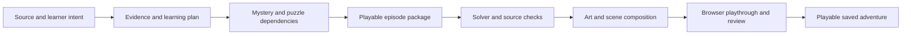

# Generating adventures from sources

Design proposal, September 10, 2026. This document describes the next increment; these generation capabilities are not yet implemented. Bramble Bay remains the authored reference case.

The selected first generated topic is **transformer neural networks**, for high-school/introductory-college learners. The initial scope is sequence position, attention and causal masking. It requires a new reviewed mechanic family; the current circuit/routing generator cannot teach this topic yet.

## Recommendation

Generate a complete, validated episode for a reusable adventure engine. Astra should design the mystery, characters, evidence, puzzle dependencies and scene composition. Reviewed mechanics should calculate outcomes and verify progression. Generate artwork after the case works with placeholder art.

This gives the model substantial creative freedom while retaining repeatable gameplay. A single prompt that rewrites the existing three-station mission cannot produce Bramble Bay's interwoven investigations. Generating a new application for every upload could eventually support novel mechanics, but it makes correctness, persistence and visual consistency harder to establish. Start with authored mechanic families and add new families deliberately.

The reusable unit is a mechanic, not an entire plot. Episodes should vary their dependency graph, character motives, item uses, room changes and final situation. Merely replacing names and numbers is not the target.

## What already exists

| Foundation | Reuse and necessary change |
| --- | --- |
| `server/sources.ts` | Reuse bounded URL fetching, PDF/text extraction and source IDs. Add a document manifest, content hash, extraction coverage and stable passage offsets. Current input is one source, at most 10 MB, 60 PDF pages and 24,000 extracted characters; PDFs currently have no visual interpretation. |
| `server/generation.ts` | Reuse structured parsing, exact evidence checks, cancellation and provider errors. Replace the fixed three-station schema with several smaller generation stages. Exact quotation matching is only one grounding check. |
| `src/domain/circuits.ts`, `wiring.ts`, `routing.ts` | Preserve tested subject calculations behind mechanic adapters. Add a separate Transformer adapter; existing circuits and routes do not model attention. |
| `src/adventure/` | Keep the presentation, item interaction, dialogue, map, notes, room effects and saves. Move Bramble-specific IDs, conditions, dialogue, puzzle copy and rewards into episode data. |
| Existing tests and browser playthrough | Preserve Bramble Bay as the migration reference. Add separate checks for generated packages and cross-episode isolation. |

The largest change is content separation. `model.ts` fixes the room/item/puzzle identifiers; `engine.ts` contains the story rules; `AdventurePuzzle.tsx` embeds particular apparatus and story assumptions. `AdventureApp.tsx` and `RoomCanvas.tsx` also contain Bramble-specific storage, art and ending behavior.

## The generation process

1. **Understand the material.** Extract claims, examples, prerequisites and potential misconceptions with page/passage references. Record uncertainty and contradictory statements. Show what pages were covered; never silently represent a truncated chapter as completely read. A large document should produce a choice of focused episodes rather than one overloaded mission.
2. **Choose what the learner will do.** Select two or three consequential ideas and identify observable actions that use them. For each idea, record an initial supported encounter, an application with less help, and a changed final problem. Keep source assertions separate from fictional setting details and from simplifying assumptions introduced by the game.
3. **Design the adventure.** Produce a short premise, character motives, two independently approachable leads, a convergence, a reversal, and an ending. Include plausible inventory recipes, clues available before required deductions, reasons to revisit rooms, optional generosity and harmless jokes. Design several concise premises, then develop the strongest feasible one.
4. **Compile episode data.** Expand the chosen plan into rules, dialogue, objects, notebook entries, puzzle configurations, hints and asset requests. Reject undefined objects and unsupported mechanics. Produce a reference action trace, then verify it with the engine rather than trusting its author.
5. **Validate and repair.** Return precise diagnostics to the stage responsible for an error. Cap repairs and retain the last valid stage. A failed background should not regenerate the entire story. Report a bounded failure rather than releasing a broken adventure.
6. **Produce art and test the actual game.** Use a shared art direction and reference sheets. Compose scenes from backgrounds, character layers, collectible objects and state variants; render educational labels and apparatus with code. Inspect real screenshots and exercise actual controls before releasing the episode.

The creator should show a concise direction preview: premise, concepts, intended length and visual setting. Progress should name useful stages, with cancellation and resumable jobs. Ordinary gameplay should continue to run without model calls.

## Proposed episode contract

Introduce `AdventurePackageV1` alongside the earlier `MissionPackage`, rather than overloading its station fields.

| Section | Contents |
| --- | --- |
| Identity | Schema version, episode ID, revision, title, learner level and mechanic versions |
| Evidence | Document hashes, passage IDs, page/URL locations, cited claims and explicit assumptions |
| Learning | Objectives, prerequisite ideas, misconception hypotheses and planned action evidence |
| World | Scenes, exits, hotspot bounds, asset manifest, characters, item descriptions and state variants |
| Story | Dialogue nodes, inventory recipes, interaction rules, discoveries and optional branches |
| Puzzles | Reviewed family ID, validated configuration, contextual copy and objective/source mapping |
| Completion | Ending conditions, optional rewards and a reference solution trace |

Use a finite vocabulary of conditions (`hasItem`, `flag`, `discovered`, `puzzlePassed`, `all`, `any`, `not`) and effects (`grantItem`, `consumeItem`, `setFlag`, `discover`, `showDialogue`, `openPuzzle`, `changeSceneState`). Validate identifiers, rule priority and effect semantics. No generated JavaScript, HTML, network instructions or executable expressions belong in the package.

Puzzle adapters should accept actions and compute validated results. The current unqualified `solve` action should become an engine-verified completion derived from the active puzzle's state and configuration. Save data and drafts need episode ID, package revision and mechanic version so one case cannot inherit another case's progress.

## Making it fun and educational

Every required concept should help the player solve a problem they understand and care about. Connecting independent circuits keeps harbor signals working; repairing a message machine gives position and attention a concrete purpose. A locked door followed by a disconnected quiz does not meet this requirement.

Require visible consequences: a lamp responds, a delivery takes a different route, an NPC changes their account, or a newly understood clue changes a familiar room. Let wrong hypotheses produce informative, recoverable outcomes. Hints should move from noticing, to interpreting, to suggesting an action. Hint use is assistance, not failure.

Keep characters' personalities and optional play independent of assessment. A crab can simply be funny. Optional kindness can earn a toy without becoming a hidden graduation requirement. Test the final concept in a changed situation; record completion, assistance and independent application separately. Do not label those events as proven mastery or retention.

For subjects without a supported mechanic, return a useful coverage explanation. Later families can include evidence comparison, causal intervention, constrained resource allocation or sequencing. Humanities cases need source-backed interpretations and competing evidence; they must not invent a single objectively correct answer to a contested question. Broad subject coverage comes from expanding these families, not forcing every upload into circuits or route maps.

## Model and document choices

Keep the configured `gpt-6-astra` for source reasoning and episode design initially. Its official model page lists image input, structured outputs and image-generation tool support. Actual API access still depends on the account; this exploration did not make a new paid generation call. [Official model reference](https://developers.openai.com/api/docs/models/gpt-6-astra).

Use strict schemas for each stage, with explicit insufficient-source and unsupported-mechanic outcomes. Schema conformance does not establish factual correctness; OpenAI's guide explicitly notes that structured outputs can contain mistakes. Retain source checks, deterministic validators and review. [Structured Outputs](https://developers.openai.com/api/docs/guides/structured-outputs).

For diagram-heavy PDFs, evaluate native file input on selected pages. The API can provide both extracted text and page images to a vision-capable model, unlike our current text-only parser. This can increase input usage and does not guarantee correct diagram interpretation. Preserve page provenance and validate a small fixture before widening support. [File inputs](https://developers.openai.com/api/docs/guides/file-inputs).

For automatic room art, test reference-image generation and edits against the Bramble art direction. The Responses image-generation workflow supports multi-turn editing and image references. Keep an asset manifest and inspect silhouettes, hotspot placement and state changes. [Image generation](https://developers.openai.com/api/docs/guides/image-generation).

Use application-owned jobs with persisted stage results, explicit cancellation, bounded retries and usage totals. The current request timeout is too restrictive for a full illustrated episode. Store private uploaded sources outside the repository; public sharing should be a separate export decision. A maximum text/image budget should bound each job. Record actual usage before promising a per-adventure cost or turnaround.

## First proof: The Case of the Mixed-Up Messages

Selected topic: transformer neural networks. Proposed story: Bramble Bay's new message machine is sending confidently muddled announcements. A tea delivery has become a tea inspection, a captain is reporting to a teapot, and Tock insists the printer is perfectly calibrated. The player investigates what changed before the harbor's evening broadcast.

Use **Attention Is All You Need**, sections 3.1–3.5, as the initial source candidate. The paper describes an encoder-decoder architecture, learned token embeddings, added positional information, attention computed from Q/K/V, and a decoder self-attention mask. Those mechanisms support the first case; training, full model reconstruction and the architecture of every modern LLM are outside this episode. [Original paper](https://arxiv.org/html/1706.03762v7#S3).

The following story, devices and learning tasks are proposed original game design. They are not examples from the paper. An apparatus is an explicitly simplified numeric demonstration, not a trained language model that actually understands the fictional telegrams.

| Investigation | Player action and payoff |
| --- | --- |
| The displaced sequence | Compare the original dispatch slip with the received strip. Recover a registration comb from the print room, repair the position mechanism and replay the same token set in two orders. See the input representations change with position. Recovering the comb requires a small inventory interaction and a clue from an earlier room. |
| The attention cabinet | Follow a separate maintenance lead to recover the machine's reference cartridge. Trace Q/K/V through a transparent apparatus, repair the swapped connections and compare its numeric trace with a working reference. Change a query or a value and observe which part of the result changes. Output mixtures illuminate a physical display; the result is computed by the adapter. |
| The suspiciously perfect rehearsal | Both leads restore the rehearsal, but a live transmission fails. Its diagnostic tape reveals information leaking from later input positions. Fit the appropriate visibility shutter and test a different sequence. The repair must preserve earlier outputs when later inputs are changed. Then release the evening broadcast. |

The leads can be explored in either order and converge before the live-broadcast reversal. Keep NPC testimony, recoverable tools, incidental jokes and an optional lost-message favor between apparatus encounters. The secret reward can be a little announcement booth with deliberately silly captions. There is no countdown.

The attention apparatus should compute `softmax(QKᵀ / √dₖ + mask)V` with explicit small matrices. Q/K score comparisons determine weights; values supply the mixture. A causal mask blocks later positions in the appropriate decoder demonstration, not in every Transformer component. Label matrices and show intermediate results in an optional inspection view. [Attention and masking, sections 3.2.1–3.2.3](https://arxiv.org/html/1706.03762v7#S3.SS2).

### New reviewed mechanics required

Add a proposed `src/domain/transformers.ts` with finite-shape validation, embedding lookup, chosen position encoding, matrix projections, stable row-wise masked softmax and weighted sums. Add an apparatus adapter and renderer that use those results. Keep fixture values small and editable by the generator only within validated bounds. Reject non-finite data, incompatible dimensions and rows with no allowed key.

Useful invariants: weights are nonnegative and sum to one over allowed keys; blocked weights are zero; changing V alone leaves weights unchanged; in unmasked attention, jointly permuting K and V leaves a single query's output unchanged; a causal prefix is unaffected by later inputs. Test these properties and independent hand-calculated fixtures, including both masked and unmasked cases. For a next-token example, distinguish the current input position from its shifted prediction target so the demonstration does not leak the answer through its own input.

For the position demonstration, avoid claiming that numerical changes alone prove sentence understanding. Use a controlled comparison of token representations and a source-backed explanation. Avoid assigning universal human meanings to embedding coordinates or declaring fixed jobs for attention heads. Any semantic captions are authored illustrations. The full-model notebook should locate the apparatus within the larger architecture and name omitted components.

This first case should establish three learner actions: distinguish identity from order, trace how context is mixed, and diagnose future-information leakage. Optional follow-up episodes can address multiple heads, the rest of a Transformer block, training and generation in more depth.

Success means an uploaded source produces this kind of complete episode through the pipeline and runs in the shared player without case-specific code edits. A human-written package proves the engine abstraction only; it is not evidence that generation works.

## Implementation order and acceptance

1. **Package the current case.** Extract the rule interpreter, puzzle adapters and episode-scoped saves. Bramble Bay must still pass the complete main/optional UI playthrough and existing regression suite. Preserve current saves through an explicit migration or retain the existing player during migration.
2. **Build the Transformer apparatus, then generate the case.** First verify the new numeric adapter and make the three concept interactions enjoyable with a tiny fixture. Then build source → learning plan → dependency graph → package with checkpointed jobs and existing art. Prove a real uploaded Transformer source produces the complete case without further story-specific runtime edits.
3. **Generate the presentation.** Add art briefs, reference consistency, asset caching, individual asset regeneration and visual checks. Quality includes readable props, consistent characters and state changes that agree with the story.
4. **Evaluate before widening support.** Use a focused Transformer source, a paraphrased supported explanation, an attention-only excerpt that lacks the selected episode's full coverage, an unrelated source, a contradictory source and a diagram-dependent source. Test multiple generations of supported inputs and record failures, repair counts, cost and latency. Missing coverage should narrow the plan or explain the gap accurately. Retain circuit/route fixtures for regression.

For each accepted package, check source/ID integrity, tested puzzle configurations, reachable completion, required evidence coverage, reference solution replay, alternate lead orders, optional-quest independence, save/resume and visible controls. For bounded finite story states, check reachability and whether mandatory items can be consumed into a dead end. Keep continuous apparatus validation inside its adapter. Random exploration supplements these checks and does not prove universal solvability.

Finally, observe target learners: where they are curious, confused or bored; whether they can explain the solution; and whether they can apply it to a changed problem. That evidence determines whether the generator is producing worthwhile educational games.
